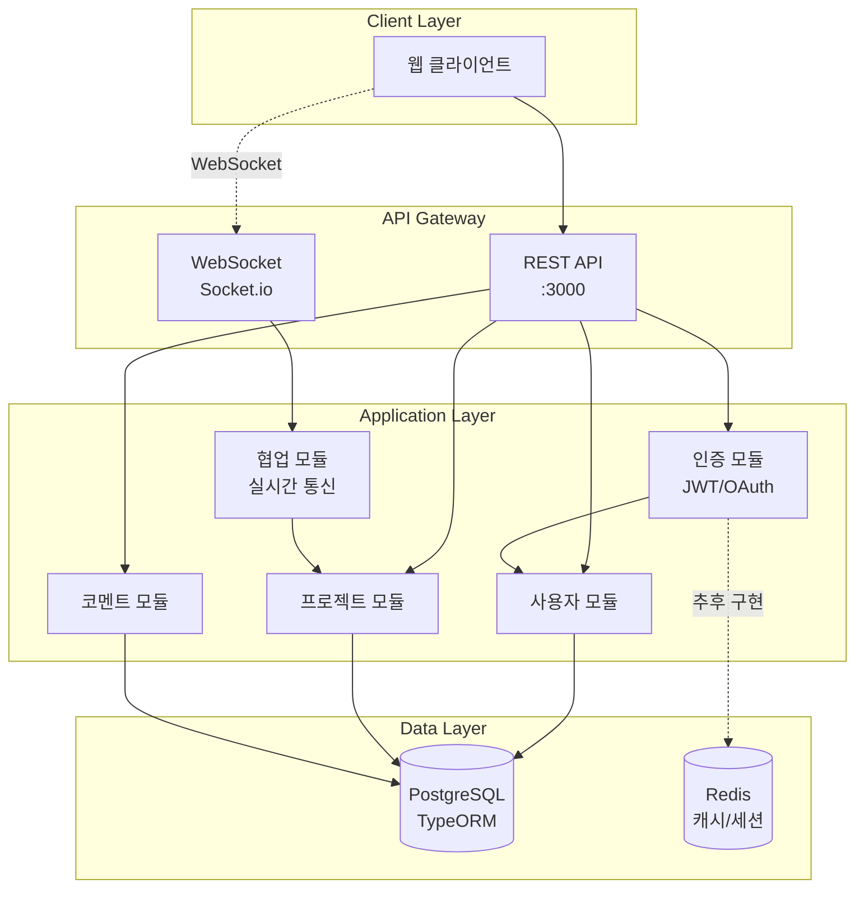

# Triad - 실시간 웹 협업 도구 백엔드

실시간 커서 공유와 코멘트 기능을 제공하는 웹 협업 도구의 백엔드 서버입니다.

## 최근 업데이트

### v0.2.0 (2025-09-08)

- TypeScript strict 모드 적용 및 모든 any 타입 제거
- 코드 품질 개선 및 ESLint 규칙 강화
- 주석 한글화 및 import 정렬 규캙 적용
- CLAUDE.md 및 DEVELOPMENT_CONVENTION.md 문서 업데이트

## 버전 히스토리

| 버전   | 날짜       | 주요 변경사항                                                               |
| ------ | ---------- | --------------------------------------------------------------------------- |
| v0.2.0 | 2025-09-08 | TypeScript strict 모드 적용, 코드 품질 개선, 문서화 강화                    |
| v0.1.0 | 2025-09-08 | JWT 기반 인증 시스템, OAuth 2.0 (Google/GitHub), Socket.io 실시간 통신 구현 |
| v0.0.1 | 2025-09-08 | NestJS 프로젝트 초기 설정, 개발 컨벤션 수립, 기본 인프라 구축               |

## 프로젝트 구조



## 구현된 기능

### 인증 시스템

- JWT 기반 액세스/리프레시 토큰
- 로컬 회원가입/로그인
- OAuth 2.0 소셜 로그인
  - Google OAuth
  - GitHub OAuth

### 실시간 협업

- Socket.io 기반 WebSocket 통신
- 프로젝트별 룸 관리
- 실시간 커서 위치 공유
- 실시간 코멘트 생성/삭제
- 사용자 접속 상태 관리

### 사용자 관리

- 사용자 CRUD
- 프로필 관리
- OAuth 프로바이더 연동

## 기술 스택

- **Framework**: NestJS (TypeScript)
- **Database**: PostgreSQL + TypeORM
- **Authentication**: Passport.js, JWT
- **Real-time**: Socket.io
- **Validation**: class-validator, class-transformer
- **Documentation**: Swagger/OpenAPI

## 개발 환경 설정

### 필수 요구사항

- Node.js 18+
- PostgreSQL 14+
- npm

### 설치 및 실행

```bash
# 의존성 설치
npm install

# 데이터베이스 실행 (Docker)
docker-compose up -d

# 환경 변수 설정
cp .env.example .env
# .env 파일 수정

# 개발 서버 실행
npm run start:dev
```

### 주요 명령어

```bash
# 린트 검사
npm run lint

# 타입 체크
npm run typecheck

# 테스트 실행
npm test

# 빌드
npm run build

# 프로덕션 실행
npm run start:prod
```

## 프로젝트 파일 구조

```
src/
├── auth/          # 인증 관련 (JWT, OAuth)
├── users/         # 사용자 관리
├── collaboration/ # 실시간 협업 (Socket.io)
├── comments/      # 코멘트 기능 (예정)
├── projects/      # 프로젝트 관리 (예정)
├── common/        # 공통 유틸리티
└── config/        # 설정 파일
```

## 환경 변수

```env
# Database
DATABASE_HOST=localhost
DATABASE_PORT=5432
DATABASE_USER=postgres
DATABASE_PASSWORD=postgres
DATABASE_NAME=triad

# JWT
JWT_SECRET=your-jwt-secret
JWT_REFRESH_SECRET=your-refresh-secret

# OAuth
GOOGLE_CLIENT_ID=your-google-client-id
GOOGLE_CLIENT_SECRET=your-google-client-secret
GITHUB_CLIENT_ID=your-github-client-id
GITHUB_CLIENT_SECRET=your-github-client-secret

# Frontend
FRONTEND_URL=http://localhost:3001
```

## API 문서

서버 실행 후 Swagger 문서 확인:

```
http://localhost:3000/api/docs
```

## WebSocket 이벤트

### 클라이언트 → 서버

- `join-project`: 프로젝트 룸 참가
- `leave-project`: 프로젝트 룸 나가기
- `cursor-move`: 커서 위치 업데이트
- `comment-create`: 코멘트 생성
- `comment-delete`: 코멘트 삭제

### 서버 → 클라이언트

- `connected`: 연결 성공
- `project-joined`: 프로젝트 참가 완료
- `user-joined`: 다른 사용자 참가
- `user-left`: 다른 사용자 나감
- `cursor-update`: 커서 위치 업데이트
- `comment-created`: 새 코멘트 생성됨
- `comment-deleted`: 코멘트 삭제됨

## 개발 예정

- [ ] 프로젝트 관리 API
- [ ] 코멘트 스레드 기능
- [ ] 실시간 동시 편집
- [ ] Redis 캐싱
- [ ] 파일 업로드
- [ ] 알림 시스템
- [ ] 권한 관리 시스템

## 라이선스

개인 프로젝트입니다.

## 개발자

김형주 (kim62210@gmail.com)

---

_이 프로젝트는 계속 개발 중입니다. 기능이 추가되거나 변경될 수 있습니다._
