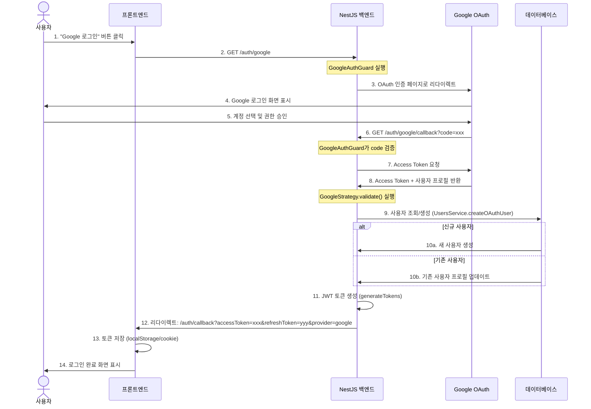
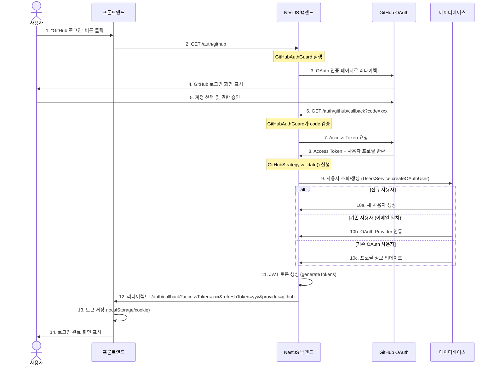
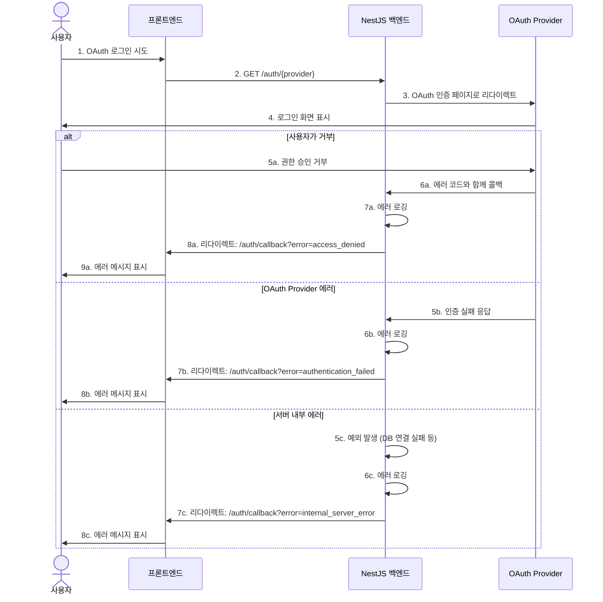
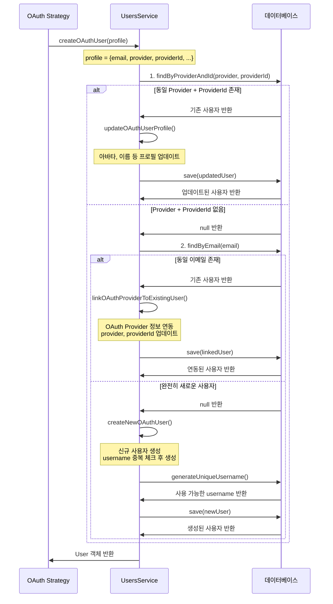

# OAuth 인증 시퀀스 다이어그램

## Google OAuth 로그인 흐름



## GitHub OAuth 로그인 흐름



## 에러 처리 흐름



## 사용자 생성/연동 상세 흐름



## 주요 엔드포인트 및 역할

### 1. 인증 시작 엔드포인트
- **GET /auth/google**: Google OAuth 인증 시작
- **GET /auth/github**: GitHub OAuth 인증 시작

이 엔드포인트들은 실제로 응답을 반환하지 않고, Guard가 자동으로 OAuth Provider로 리다이렉트합니다.

### 2. 콜백 엔드포인트
- **GET /auth/google/callback**: Google OAuth 콜백 처리
- **GET /auth/github/callback**: GitHub OAuth 콜백 처리

콜백 엔드포인트는 다음 작업을 수행합니다:
1. OAuth Provider로부터 받은 인증 코드 검증
2. 사용자 프로필 정보 가져오기
3. DB에서 사용자 조회/생성/업데이트
4. JWT 토큰 생성 (Access Token + Refresh Token)
5. 프론트엔드로 토큰과 함께 리다이렉트

### 3. 토큰 생성 (AuthService.generateTokens)
```typescript
{
  accessToken: "eyJhbGc...",  // 15분 유효
  refreshToken: "eyJhbGc...", // 7일 유효
  tokenType: "Bearer",
  expiresIn: 900,
  user: {
    id: "...",
    email: "...",
    username: "..."
  }
}
```

## 환경 변수 설정

OAuth 기능을 사용하려면 다음 환경 변수가 필요합니다:

```env
# Google OAuth
GOOGLE_CLIENT_ID=your-google-client-id
GOOGLE_CLIENT_SECRET=your-google-client-secret

# GitHub OAuth
GITHUB_CLIENT_ID=your-github-client-id
GITHUB_CLIENT_SECRET=your-github-client-secret

# Frontend URL (콜백 리다이렉트용)
FRONTEND_URL=http://localhost:3001

# JWT 설정
JWT_SECRET=your-jwt-secret
JWT_REFRESH_SECRET=your-jwt-refresh-secret
JWT_EXPIRES_IN=15m
JWT_REFRESH_EXPIRES_IN=7d
```

환경 변수가 설정되지 않은 Provider는 자동으로 비활성화됩니다.

## 프론트엔드 구현 예시

### 1. OAuth 로그인 버튼
```typescript
const handleGoogleLogin = () => {
  window.location.href = 'http://localhost:3000/auth/google';
};

const handleGitHubLogin = () => {
  window.location.href = 'http://localhost:3000/auth/github';
};
```

### 2. 콜백 페이지 처리
```typescript
// /auth/callback 페이지
useEffect(() => {
  const params = new URLSearchParams(window.location.search);
  const accessToken = params.get('accessToken');
  const refreshToken = params.get('refreshToken');
  const error = params.get('error');
  const provider = params.get('provider');

  if (error) {
    // 에러 처리
    console.error('OAuth 로그인 실패:', error);
    navigate('/login?error=' + error);
    return;
  }

  if (accessToken && refreshToken) {
    // 토큰 저장
    localStorage.setItem('accessToken', accessToken);
    localStorage.setItem('refreshToken', refreshToken);

    // 메인 페이지로 이동
    navigate('/');
  }
}, []);
```

## 보안 고려사항

1. **HTTPS 사용 필수**: 프로덕션 환경에서는 반드시 HTTPS를 사용해야 합니다.
2. **State 파라미터**: CSRF 공격 방지를 위해 OAuth state 파라미터를 사용합니다 (Passport가 자동 처리).
3. **토큰 저장**: Access Token은 메모리에, Refresh Token은 HttpOnly 쿠키에 저장하는 것을 권장합니다.
4. **CORS 설정**: 프론트엔드 도메인을 CORS 허용 목록에 추가해야 합니다.
5. **Callback URL 검증**: OAuth Provider 콘솔에 등록된 Callback URL만 허용됩니다.