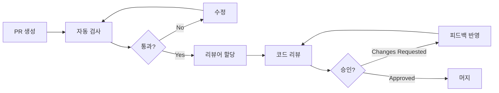

# 코드 리뷰 가이드라인

## 개요
효과적이고 건설적인 코드 리뷰를 위한 가이드라인입니다. 코드 품질 향상과 팀 협업 강화를 목표로 합니다.

## 코드 리뷰의 목적

1. **버그 예방**: 프로덕션 배포 전 잠재적 문제 발견
2. **코드 품질 향상**: 가독성, 유지보수성, 성능 개선
3. **지식 공유**: 팀원 간 기술 지식과 도메인 지식 전파
4. **표준 준수**: 코딩 컨벤션과 아키텍처 패턴 일관성 유지
5. **성장 기회**: 서로에게 배우고 멘토링하는 기회 제공

## 역할과 책임

### 작성자 (Author)
- PR 생성 전 셀프 리뷰 수행
- 명확한 PR 제목과 설명 작성
- 리뷰어가 이해하기 쉽도록 컨텍스트 제공
- 피드백에 신속하고 건설적으로 응답
- 필요시 추가 설명이나 문서 제공

### 리뷰어 (Reviewer)
- 24시간 이내 리뷰 시작 (긴급한 경우 더 빠르게)
- 건설적이고 구체적인 피드백 제공
- 코드뿐만 아니라 설계와 아키텍처도 검토
- 긍정적인 피드백도 함께 제공
- 학습 기회로 활용

## PR (Pull Request) 작성 가이드

### PR 템플릿

```markdown
## 작업 내용
<!-- 이 PR에서 수행한 작업을 간단히 설명 -->

## 목적
<!-- 왜 이 변경이 필요한지 설명 -->

## 주요 변경사항
<!-- 주요 변경 파일과 로직을 나열 -->
- [ ] 기능 A 구현
- [ ] 버그 B 수정
- [ ] 리팩토링 C

## 스크린샷/데모
<!-- UI 변경사항이 있다면 스크린샷 첨부 -->

## 체크리스트
- [ ] 코드 셀프 리뷰 완료
- [ ] 테스트 작성/수정
- [ ] 문서 업데이트
- [ ] 린트 검사 통과
- [ ] 타입 체크 통과
- [ ] 브랜치 최신 상태 유지

## 테스트 방법
<!-- 리뷰어가 테스트할 수 있는 단계별 가이드 -->
1. 
2. 
3. 

## 관련 이슈
<!-- 관련 이슈 번호 링크 -->
Closes #123

## 리뷰 요청사항
<!-- 특별히 신경써서 봐주었으면 하는 부분 -->
```

### PR 크기 관리

| PR 크기 | 변경 라인 수 | 리뷰 시간 | 권장도 |
|---------|-------------|-----------|--------|
| XS | < 10 | 5분 | 매우 높음 |
| S | 10-100 | 30분 | 높음 |
| M | 100-500 | 1시간 | 보통 |
| L | 500-1000 | 2시간 | 낮음 |
| XL | > 1000 | 3시간+ | 매우 낮음 |

**원칙**: 작고 집중된 PR을 지향. 큰 변경은 여러 PR로 분할

## 리뷰 체크리스트

### 1. 기능성 (Functionality)
- [ ] 요구사항을 모두 충족하는가?
- [ ] 엣지 케이스를 처리하는가?
- [ ] 에러 처리가 적절한가?
- [ ] 기존 기능을 깨뜨리지 않는가?

### 2. 설계 (Design)
- [ ] SOLID 원칙을 준수하는가?
- [ ] 적절한 디자인 패턴을 사용하는가?
- [ ] 모듈 간 결합도가 낮은가?
- [ ] 확장 가능한 구조인가?

### 3. 코드 품질 (Code Quality)
- [ ] 코드가 읽기 쉽고 이해하기 쉬운가?
- [ ] 네이밍이 명확하고 일관성 있는가?
- [ ] 중복 코드가 없는가?
- [ ] 복잡도가 적절한가?

### 4. 성능 (Performance)
- [ ] 불필요한 연산이나 호출이 없는가?
- [ ] 적절한 자료구조를 사용하는가?
- [ ] 메모리 누수 가능성이 없는가?
- [ ] 데이터베이스 쿼리가 최적화되어 있는가?

### 5. 보안 (Security)
- [ ] 입력 검증이 적절한가?
- [ ] 인증/인가 처리가 올바른가?
- [ ] 민감 정보가 노출되지 않는가?
- [ ] SQL Injection 등 보안 취약점이 없는가?

### 6. 테스트 (Testing)
- [ ] 테스트 커버리지가 충분한가?
- [ ] 테스트가 의미 있고 효과적인가?
- [ ] 엣지 케이스를 테스트하는가?
- [ ] 테스트가 독립적이고 반복 가능한가?

### 7. 문서화 (Documentation)
- [ ] 복잡한 로직에 주석이 있는가?
- [ ] API 문서가 업데이트되었는가?
- [ ] README가 최신 상태인가?
- [ ] 변경 로그가 작성되었는가?

## 피드백 작성 가이드

### 피드백 레벨

```typescript
// MUST: 반드시 수정해야 함 (버그, 보안 이슈)
// SHOULD: 수정을 강력히 권장 (성능, 설계 문제)
// CONSIDER: 고려해볼 만함 (개선 제안)
// THOUGHT: 의견 또는 질문 (토론 유도)
// NICE: 잘한 부분 칭찬
```

### 좋은 피드백 예시

```typescript
// 좋은 예
// SHOULD: 이 메서드는 O(n²) 복잡도를 가집니다. 
// Map을 사용하면 O(n)으로 개선할 수 있습니다:
const userMap = new Map(users.map(u => [u.id, u]));
return items.map(item => userMap.get(item.userId));

// 나쁜 예
// 이 코드는 느립니다. 다시 작성하세요.
```

### 피드백 원칙

1. **구체적이고 실행 가능하게**: 문제점과 해결방안을 명확히 제시
2. **왜(Why) 설명하기**: 변경이 필요한 이유를 설명
3. **예시 제공**: 가능하면 코드 예시 제공
4. **긍정적 톤 유지**: 비판이 아닌 개선 제안
5. **학습 기회 제공**: 관련 문서나 리소스 링크 공유

## 리뷰 프로세스



### 리뷰 우선순위

1. **Critical**: 프로덕션 버그 수정, 보안 패치
2. **High**: 주요 기능, 마감일이 있는 작업
3. **Medium**: 일반 기능 개발
4. **Low**: 리팩토링, 문서 업데이트

## 리뷰 메트릭

### 추적 지표
- **리뷰 응답 시간**: 24시간 이내 목표
- **리뷰 라운드 수**: 2-3회 이내 목표
- **PR 크기**: 평균 200줄 이하 목표
- **머지까지 시간**: 3일 이내 목표

### 월간 리뷰
- 팀 전체 리뷰 통계 공유
- 베스트 리뷰어 선정
- 개선 사항 논의

## 도구 활용

### GitHub 기능
- **Draft PR**: 작업 중인 코드 미리 공유
- **Code Owners**: 자동 리뷰어 할당
- **Required Reviews**: 최소 승인 수 설정
- **Branch Protection**: 머지 규칙 설정

### 자동화 도구
```yaml
# .github/workflows/pr-check.yml
name: PR Check
on: [pull_request]
jobs:
  lint:
    runs-on: ubuntu-latest
    steps:
      - uses: actions/checkout@v2
      - run: npm ci
      - run: npm run lint
      
  test:
    runs-on: ubuntu-latest
    steps:
      - uses: actions/checkout@v2
      - run: npm ci
      - run: npm test
      
  build:
    runs-on: ubuntu-latest
    steps:
      - uses: actions/checkout@v2
      - run: npm ci
      - run: npm run build
```

## 코드 리뷰 에티켓

### Do's
- 시간을 내어 꼼꼼히 리뷰
- 질문을 통해 이해도 높이기
- 대안 제시할 때 장단점 설명
- 좋은 코드에 대한 칭찬
- 배운 점 공유

### Don'ts
- 개인적인 취향 강요
- 감정적이거나 공격적인 표현
- 너무 많은 니트픽(사소한 지적)
- 컨텍스트 없는 비판
- 리뷰 지연

## 학습 자료

### 필독 자료
- [Google Engineering Practices - Code Review](https://google.github.io/eng-practices/review/)
- [Best Practices for Code Review - SmartBear](https://smartbear.com/learn/code-review/best-practices-for-peer-code-review/)
- [Effective Code Reviews - Microsoft](https://www.michaelagreiler.com/code-reviews-at-microsoft/)

### 추천 도구
- [Danger JS](https://danger.systems/js/): 자동 PR 검토
- [SonarQube](https://www.sonarqube.org/): 코드 품질 분석
- [CodeClimate](https://codeclimate.com/): 코드 품질 메트릭
- [Reviewable](https://reviewable.io/): 고급 리뷰 도구

## 리뷰 문화 구축

### 팀 규칙
1. **No PR left behind**: 모든 PR은 48시간 내 리뷰
2. **Pair Review**: 복잡한 변경은 페어 리뷰
3. **Learning Friday**: 매주 금요일 리뷰 세션
4. **Review Buddy**: 신입 개발자 멘토링

### 지속적 개선
- 분기별 리뷰 프로세스 회고
- 리뷰 가이드라인 정기 업데이트
- 팀원 피드백 수렴
- 베스트 프랙티스 공유