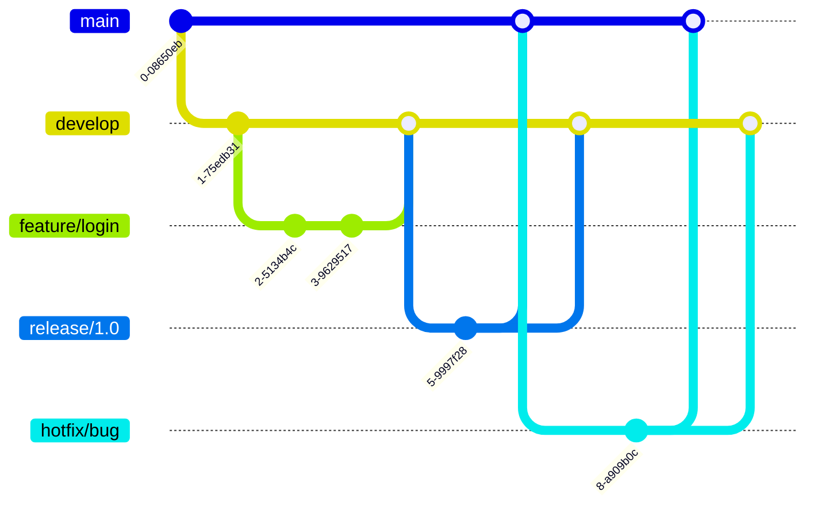

# Git 컨벤션 가이드

## 개요
일관된 Git 사용 패턴과 커밋 메시지 작성을 위한 가이드라인입니다.

## 브랜치 전략 (Git Flow)

### 브랜치 종류

| 브랜치 | 용도 | 생명주기 | 네이밍 규칙 |
|--------|------|----------|------------|
| `main` | 프로덕션 배포 | 영구 | `main` |
| `develop` | 개발 통합 | 영구 | `develop` |
| `feature/*` | 기능 개발 | 임시 | `feature/기능명` |
| `release/*` | 릴리즈 준비 | 임시 | `release/버전` |
| `hotfix/*` | 긴급 수정 | 임시 | `hotfix/이슈명` |
| `bugfix/*` | 버그 수정 | 임시 | `bugfix/버그명` |

### 브랜치 네이밍 규칙

```bash
# Feature 브랜치
feature/user-authentication
feature/socket-connection
feature/comment-system

# Bugfix 브랜치
bugfix/login-error
bugfix/memory-leak

# Hotfix 브랜치
hotfix/critical-security-patch
hotfix/payment-gateway-error

# Release 브랜치
release/1.0.0
release/2.1.0
```

### 브랜치 플로우



## 커밋 메시지 컨벤션

### 커밋 메시지 구조

```
<type>(<scope>): <subject>

<body>

<footer>
```

### Type (필수)

| Type | 설명 | 예시 |
|------|------|------|
| `feat` | 새로운 기능 추가 | `feat(auth): JWT 인증 구현` |
| `fix` | 버그 수정 | `fix(socket): 연결 끊김 문제 해결` |
| `docs` | 문서 수정 | `docs(readme): API 엔드포인트 추가` |
| `style` | 코드 포맷팅, 세미콜론 누락 등 | `style(auth): 코드 포맷팅 적용` |
| `refactor` | 코드 리팩토링 | `refactor(user): 서비스 로직 분리` |
| `test` | 테스트 추가/수정 | `test(auth): 로그인 e2e 테스트 추가` |
| `chore` | 빌드, 패키지 매니저 설정 등 | `chore(deps): socket.io 버전 업데이트` |
| `perf` | 성능 개선 | `perf(db): 쿼리 최적화` |
| `ci` | CI 설정 수정 | `ci(github): actions 워크플로우 추가` |
| `build` | 빌드 시스템 수정 | `build(webpack): 번들 크기 최적화` |
| `revert` | 커밋 되돌리기 | `revert: feat(auth): JWT 인증 구현` |

### Scope (선택)

프로젝트의 주요 모듈/컴포넌트를 나타냅니다:
- `auth`: 인증 관련
- `user`: 사용자 관리
- `socket`: Socket.io 관련
- `comment`: 코멘트 기능
- `project`: 프로젝트 관리
- `db`: 데이터베이스
- `config`: 설정

### Subject (필수)

- 50자 이내로 작성
- 마침표 없음
- 명령형, 현재 시제 사용 ("추가한다" X, "추가" O)
- 첫 글자 소문자

### Body (선택)

- 72자마다 줄바꿈
- **무엇을** 했는지보다 **왜** 했는지 설명
- 변경 사항의 이유와 이전과의 차이점 설명

### Footer (선택)

- Breaking Changes 명시
- 이슈 트래커 참조

### 커밋 메시지 예시

```bash
# 기능 추가
feat(auth): OAuth 2.0 소셜 로그인 구현

Google, GitHub OAuth 프로바이더를 통한 로그인 기능 추가
- Passport.js 전략 구현
- 토큰 저장 및 갱신 로직 추가
- 사용자 프로필 동기화

Closes #123

# 버그 수정
fix(socket): 재연결 시 메모리 누수 문제 해결

Socket 인스턴스가 제대로 정리되지 않아 발생하는 메모리 누수 수정
이전 연결의 이벤트 리스너를 명시적으로 제거

Fixes #456

# Breaking Change
feat(api)!: API 응답 형식 표준화

BREAKING CHANGE: 모든 API 응답이 새로운 형식을 따름
기존: { data: {...} }
변경: { success: boolean, data: {...}, error: {...} }

모든 클라이언트는 새로운 응답 형식에 맞게 업데이트 필요

# 여러 이슈 참조
fix(auth): 토큰 만료 처리 개선

See also: #789, #790
Closes #791
```

## 커밋 규칙

### 원자적 커밋

```bash
# 나쁜 예: 여러 기능을 한 커밋에
git commit -m "로그인 구현, 회원가입 수정, 버그 수정"

# 좋은 예: 각 기능별 분리
git commit -m "feat(auth): 로그인 API 구현"
git commit -m "fix(auth): 회원가입 유효성 검증 수정"
git commit -m "fix(user): 프로필 조회 버그 수정"
```

### 커밋 전 체크리스트

- [ ] 코드가 컴파일되는가?
- [ ] 테스트가 통과하는가?
- [ ] 린트 검사를 통과하는가?
- [ ] 관련 없는 변경사항이 포함되지 않았는가?

## 태그 관리

### 버전 태그 (Semantic Versioning)

```bash
# MAJOR.MINOR.PATCH
v1.0.0  # 첫 정식 릴리즈
v1.1.0  # 새로운 기능 추가
v1.1.1  # 버그 수정
v2.0.0  # Breaking Change

# 프리릴리즈
v1.0.0-alpha.1
v1.0.0-beta.1
v1.0.0-rc.1
```

### 태그 생성

```bash
# Annotated 태그 생성 (권장)
git tag -a v1.0.0 -m "Release version 1.0.0"

# 태그 푸시
git push origin v1.0.0

# 모든 태그 푸시
git push origin --tags
```

## Pull Request 규칙

### PR 제목

```
[Type] 간단한 설명 (#이슈번호)

# 예시
[Feat] 사용자 인증 시스템 구현 (#123)
[Fix] 소켓 연결 끊김 문제 해결 (#456)
[Refactor] 댓글 서비스 로직 개선 (#789)
```

### PR 머지 전략

| 전략 | 사용 시기 | 장점 | 단점 |
|------|-----------|------|------|
| **Merge Commit** | 기능 브랜치 통합 | 전체 히스토리 보존 | 복잡한 히스토리 |
| **Squash and Merge** | 작은 커밋이 많을 때 | 깔끔한 히스토리 | 세부 히스토리 손실 |
| **Rebase and Merge** | 선형 히스토리 원할 때 | 깔끔한 선형 히스토리 | Force push 필요 |

### 권장 머지 전략

- `feature → develop`: Squash and Merge
- `release → main`: Merge Commit
- `hotfix → main`: Merge Commit
- `main → develop`: Merge Commit

## .gitignore 설정

```gitignore
# Dependencies
node_modules/
npm-debug.log*
yarn-debug.log*
yarn-error.log*

# Production
dist/
build/

# Environment
.env
.env.local
.env.*.local

# IDE
.vscode/
.idea/
*.swp
*.swo
.DS_Store

# Testing
coverage/
.nyc_output/

# Logs
logs/
*.log

# Temporary
tmp/
temp/
*.tmp

# Database
*.sqlite
*.sqlite3

# TypeScript
*.tsbuildinfo

# Cache
.eslintcache
.cache/
```

## Git 설정

### 전역 설정

```bash
# 사용자 정보
git config --global user.name "Your Name"
git config --global user.email "your.email@example.com"

# 에디터 설정
git config --global core.editor "code --wait"

# 줄바꿈 설정
git config --global core.autocrlf input  # Mac/Linux
git config --global core.autocrlf true   # Windows

# 유용한 별칭
git config --global alias.co checkout
git config --global alias.br branch
git config --global alias.ci commit
git config --global alias.st status
git config --global alias.last 'log -1 HEAD'
git config --global alias.visual '!gitk'
git config --global alias.lg "log --graph --pretty=format:'%Cred%h%Creset -%C(yellow)%d%Creset %s %Cgreen(%cr) %C(bold blue)<%an>%Creset' --abbrev-commit"
```

### 프로젝트별 Git Hooks

```bash
# Husky 설치
npm install -D husky

# Husky 초기화
npx husky-init

# pre-commit hook
npx husky add .husky/pre-commit "npm run lint && npm test"

# commit-msg hook (커밋 메시지 검증)
npx husky add .husky/commit-msg 'npx commitlint --edit $1'
```

## Commitlint 설정

### 설치

```bash
npm install -D @commitlint/cli @commitlint/config-conventional
```

### commitlint.config.js

```javascript
module.exports = {
  extends: ['@commitlint/config-conventional'],
  rules: {
    'type-enum': [
      2,
      'always',
      [
        'feat',
        'fix',
        'docs',
        'style',
        'refactor',
        'test',
        'chore',
        'perf',
        'ci',
        'build',
        'revert'
      ]
    ],
    'scope-enum': [
      2,
      'always',
      [
        'auth',
        'user',
        'socket',
        'comment',
        'project',
        'db',
        'config',
        'deps'
      ]
    ],
    'subject-case': [2, 'never', ['sentence-case', 'start-case', 'pascal-case', 'upper-case']],
    'subject-max-length': [2, 'always', 50],
    'body-max-line-length': [2, 'always', 72]
  }
};
```

## Git 워크플로우 예시

### 새 기능 개발

```bash
# 1. develop 브랜치에서 시작
git checkout develop
git pull origin develop

# 2. feature 브랜치 생성
git checkout -b feature/user-profile

# 3. 작업 및 커밋
git add .
git commit -m "feat(user): 사용자 프로필 조회 API 구현"

# 4. 원격 저장소에 푸시
git push origin feature/user-profile

# 5. PR 생성 (GitHub/GitLab UI에서)

# 6. 리뷰 후 머지
```

### 긴급 수정

```bash
# 1. main에서 hotfix 브랜치 생성
git checkout main
git pull origin main
git checkout -b hotfix/critical-bug

# 2. 수정 및 커밋
git add .
git commit -m "fix(auth): 인증 토큰 만료 처리 수정"

# 3. main과 develop에 머지
git checkout main
git merge hotfix/critical-bug
git push origin main

git checkout develop
git merge hotfix/critical-bug
git push origin develop

# 4. 태그 생성
git tag -a v1.0.1 -m "Hotfix: 인증 토큰 만료 처리"
git push origin v1.0.1
```

## Git 통계 및 분석

### 유용한 명령어

```bash
# 기여자별 커밋 수
git shortlog -sn

# 최근 일주일 커밋 로그
git log --since="1 week ago"

# 특정 파일의 변경 이력
git log -p -- path/to/file

# 브랜치별 최근 커밋
git for-each-ref --sort=-committerdate refs/heads/ --format='%(refname:short) %(committerdate:relative)'

# 코드 변경량 통계
git diff --stat HEAD~10

# 특정 작성자의 커밋
git log --author="name"
```

## 주의사항

### 절대 하지 말아야 할 것들

1. **Force Push 금지** (main, develop 브랜치)
2. **직접 Push 금지** (main 브랜치)
3. **대용량 파일 커밋 금지** (Git LFS 사용)
4. **민감 정보 커밋 금지** (비밀번호, API 키 등)

### 문제 발생 시 대처

```bash
# 실수로 커밋한 경우
git reset --soft HEAD~1

# 잘못된 브랜치에 커밋한 경우
git cherry-pick <commit-hash>

# 민감 정보를 커밋한 경우
git filter-branch --tree-filter 'rm -f passwords.txt' HEAD
# 또는 BFG Repo-Cleaner 사용
```