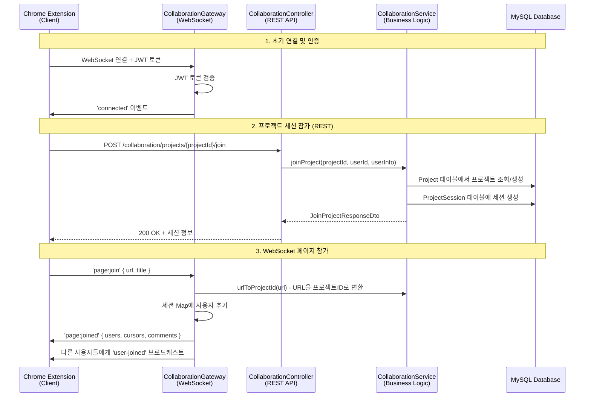
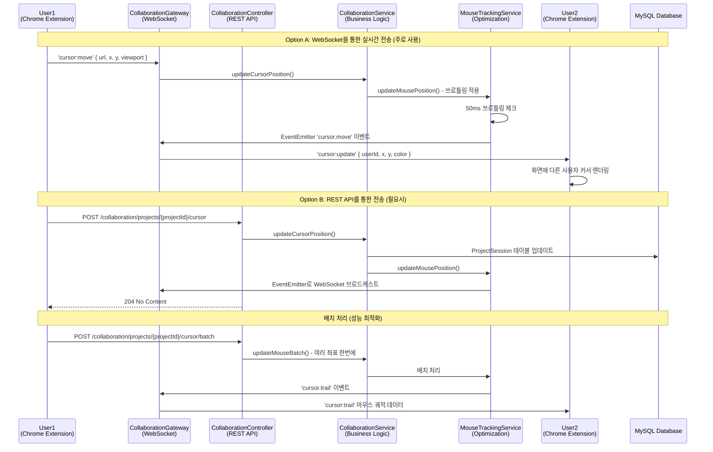
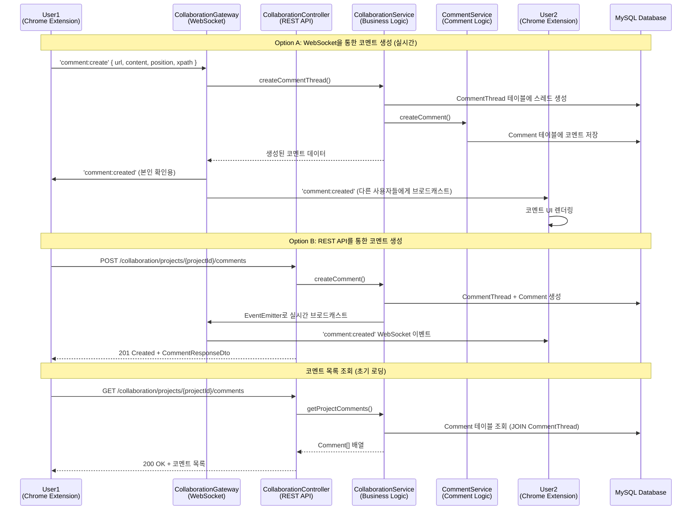
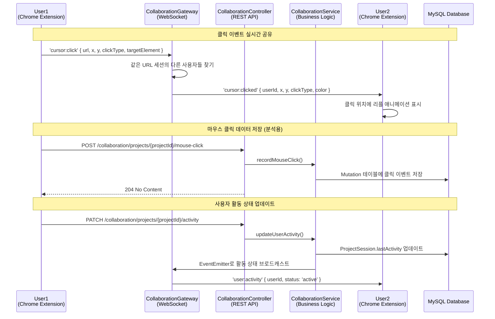
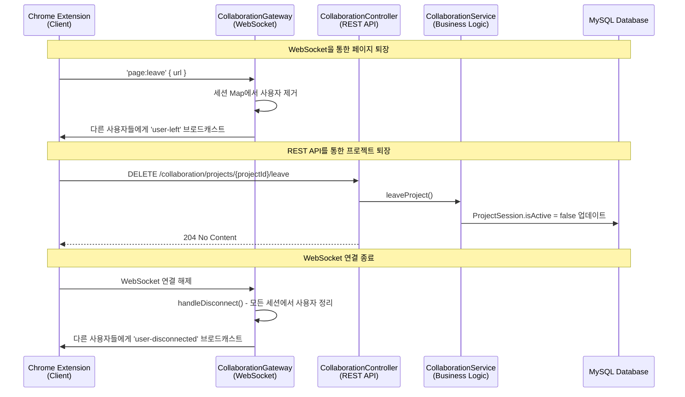

# Triad 협업 시스템 - 전체 시퀀스 다이어그램

## 개요

이 문서는 Triad 실시간 웹 협업 도구의 전체 데이터 흐름을 시퀀스 다이어그램으로 설명합니다.
Chrome Extension 클라이언트부터 MySQL 데이터베이스까지의 완전한 통신 흐름을 포함합니다.

## 시스템 구성 요소

- **Chrome Extension (Client)**: 웹페이지에 주입되는 클라이언트
- **CollaborationGateway (WebSocket)**: Socket.io 기반 실시간 통신
- **CollaborationController (REST API)**: HTTP 기반 API 엔드포인트
- **CollaborationService (Business Logic)**: 비즈니스 로직 처리
- **MouseTrackingService**: 마우스 추적 및 성능 최적화
- **CommentService**: 코멘트 관련 로직
- **MySQL Database**: 데이터 영속성

---

## 1️⃣ 초기 연결 및 세션 참가 흐름



---

## 2️⃣ 실시간 커서 동기화 흐름



---

## 3️⃣ 코멘트 생성 및 실시간 동기화 흐름



---

## 4️⃣ 클릭 이벤트 및 활동 추적 흐름



---

## 5️⃣ 세션 종료 흐름



---

## 🔑 핵심 아키텍처 특징

### 이중 통신 구조

- **WebSocket (실시간)**: 커서 이동, 클릭, 코멘트 등 즉시 동기화가 필요한 이벤트
- **REST API (안정성)**: 데이터 저장, 조회, 세션 관리 등 신뢰성이 중요한 작업

### 성능 최적화

- **쓰로틀링**: MouseTrackingService에서 50ms 간격으로 커서 이벤트 제한
- **배치 처리**: 여러 마우스 좌표를 한번에 전송하여 네트워크 부하 감소
- **이벤트 기반**: EventEmitter로 서비스 간 느슨한 결합

### 상태 관리

- **다중 Map 구조**: URL, 사용자, 소켓, 프로젝트 간의 매핑 관계 효율적 관리
- **세션 동기화**: WebSocket과 REST API 모두에서 동일한 세션 상태 유지

### URL 기반 프로젝트 관리

- URL을 해시하여 고유한 프로젝트 ID 자동 생성
- 같은 URL에 접속한 사용자끼리 자동으로 협업 세션 형성

---

## 📡 주요 이벤트 목록

### 클라이언트 → 서버 이벤트

| 이벤트명                       | 전송 방식 | 설명                  | 페이로드                                  |
| ------------------------------ | --------- | --------------------- | ----------------------------------------- |
| `page:join`                    | WebSocket | 페이지 협업 세션 참가 | `{ url, title }`                          |
| `page:leave`                   | WebSocket | 페이지 협업 세션 퇴장 | `{ url }`                                 |
| `cursor:move`                  | WebSocket | 마우스 커서 이동      | `{ url, x, y, viewport }`                 |
| `cursor:click`                 | WebSocket | 마우스 클릭 이벤트    | `{ url, x, y, clickType, targetElement }` |
| `comment:create`               | WebSocket | 코멘트 생성           | `{ url, content, position, xpath }`       |
| `POST /projects/{id}/join`     | REST API  | 프로젝트 세션 참가    | `JoinProjectDto`                          |
| `POST /projects/{id}/cursor`   | REST API  | 커서 위치 업데이트    | `UpdateCursorDto`                         |
| `POST /projects/{id}/comments` | REST API  | 코멘트 생성           | `CreateCommentRequestDto`                 |

### 서버 → 클라이언트 이벤트

| 이벤트명          | 전송 방식 | 설명                      | 페이로드                            |
| ----------------- | --------- | ------------------------- | ----------------------------------- |
| `connected`       | WebSocket | 연결 성공                 | `{ userId, username, message }`     |
| `page:joined`     | WebSocket | 세션 참가 완료            | `{ url, users, cursors, comments }` |
| `user-joined`     | WebSocket | 새 사용자 참가            | `{ userId, username, avatar }`      |
| `user-left`       | WebSocket | 사용자 퇴장               | `{ userId, username }`              |
| `cursor:update`   | WebSocket | 다른 사용자 커서 업데이트 | `{ userId, username, x, y, color }` |
| `cursor:clicked`  | WebSocket | 다른 사용자 클릭          | `{ userId, x, y, clickType }`       |
| `comment:created` | WebSocket | 새 코멘트 생성됨          | `{ comment }`                       |
| `cursor:trail`    | WebSocket | 마우스 궤적 데이터        | `{ userId, trail }`                 |

---

## 🗄️ 데이터베이스 스키마

### 주요 테이블

- **projects**: URL 기반 프로젝트 정보
- **project_sessions**: 사용자별 세션 상태
- **comment_threads**: 코멘트 스레드 (위치 기반)
- **comments**: 개별 코멘트
- **mutations**: 실시간 변경 이벤트 로그

### 관계도

```
Project (1) ──── (N) ProjectSession ──── (1) User
   │
   └── (1) ──── (N) CommentThread ──── (N) Comment ──── (1) User
   │
   └── (1) ──── (N) Mutation
```

---

## 🚀 확장 가능성

이 시스템은 다음과 같은 기능들을 쉽게 추가할 수 있도록 설계되었습니다:

1. **선택 영역 공유**: 텍스트 선택 실시간 동기화
2. **스크롤 동기화**: 스크롤 위치 공유
3. **화면 공유**: 특정 영역 하이라이트
4. **음성 채팅**: WebRTC 통합
5. **화이트보드**: 드로잉 기능
6. **파일 공유**: 드래그 앤 드롭 파일 공유

---

_이 문서는 Triad 협업 시스템의 전체 아키텍처를 이해하기 위한 참고 자료입니다._
