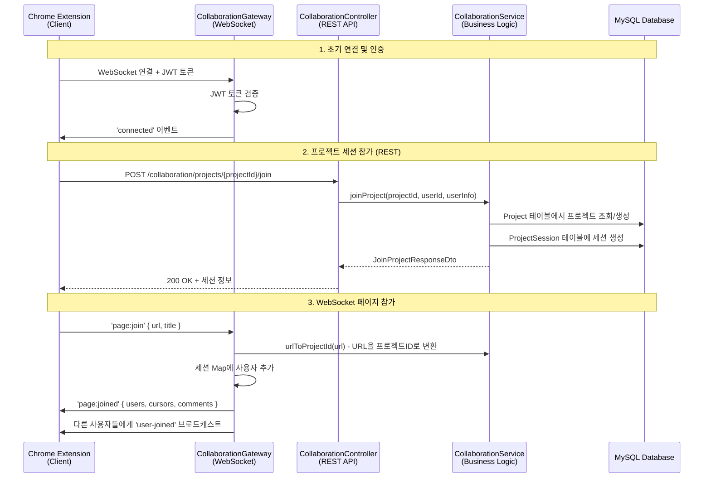
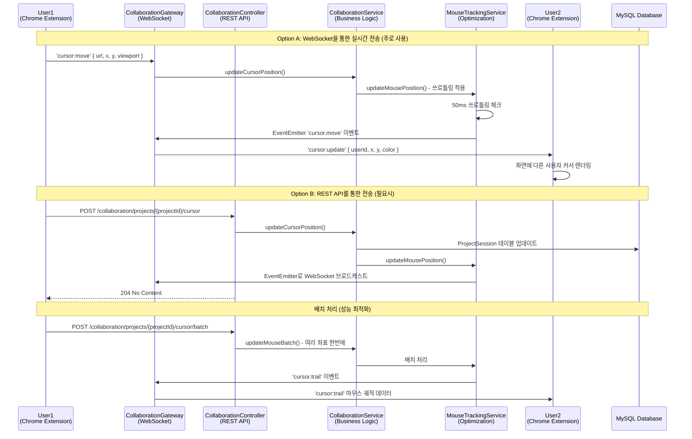
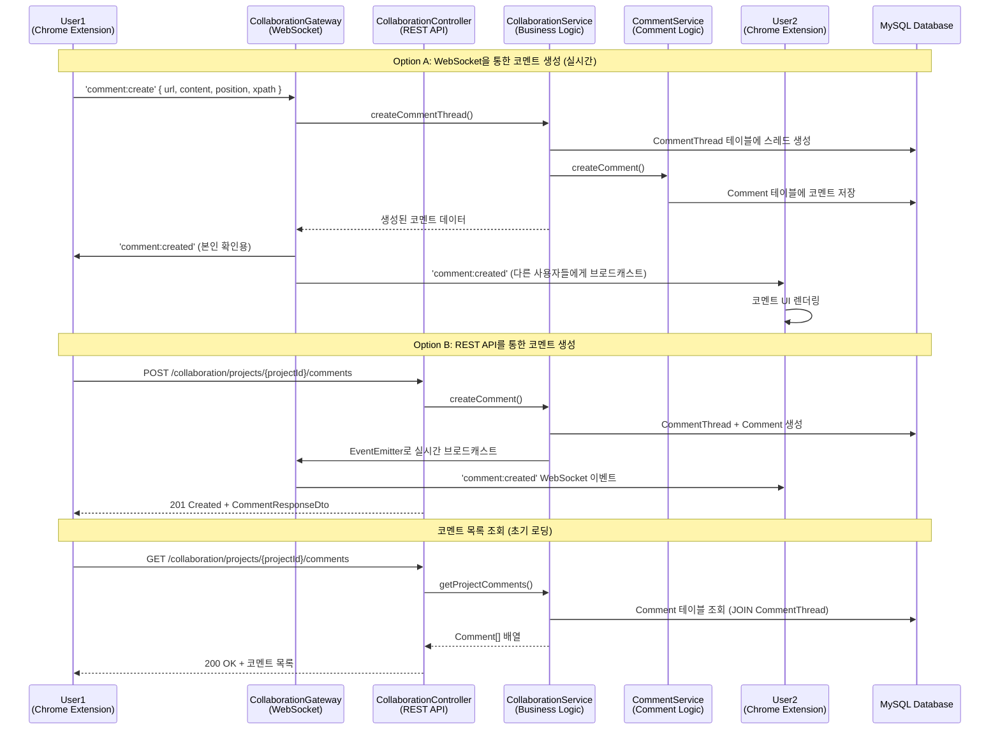
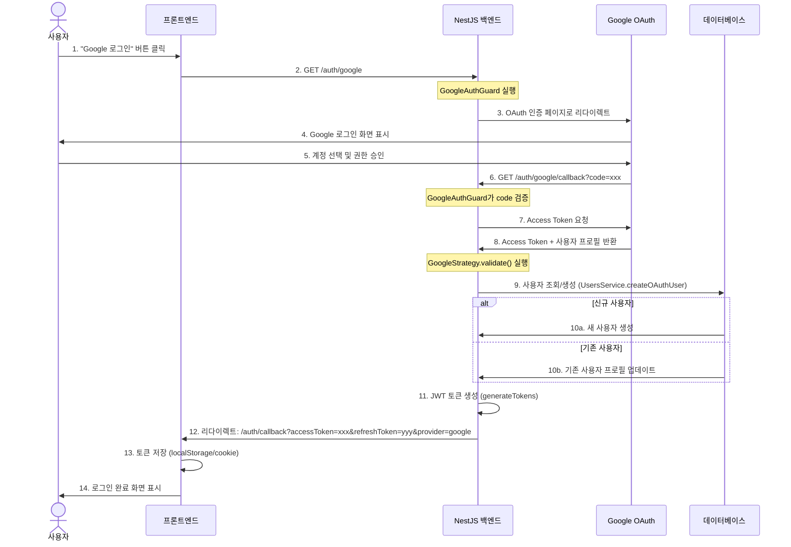
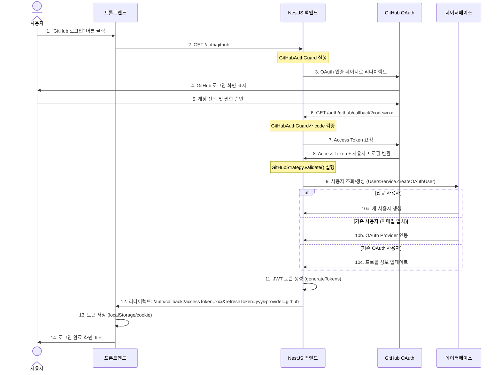
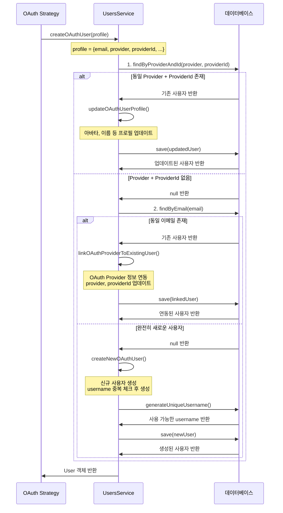
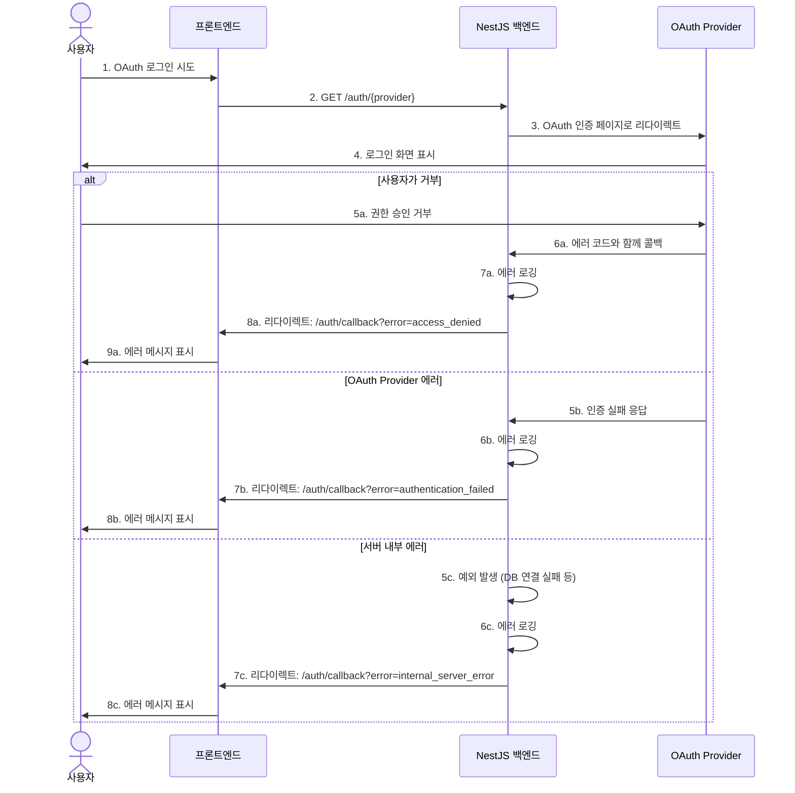

# Swagger API 문서 - 시퀀스 다이어그램 모음

이 문서는 Swagger API 문서에 표시될 모든 시퀀스 다이어그램을 포함합니다.

---

## 협업 시스템 시퀀스 다이어그램

### 1. 초기 연결 및 세션 참가 흐름

### 2. 실시간 커서 동기화 흐름

### 3. 코멘트 생성 및 실시간 동기화 흐름

---

## OAuth 인증 시퀀스 다이어그램

### 1. Google OAuth 로그인 흐름

### 2. GitHub OAuth 로그인 흐름

### 3. OAuth 사용자 생성/연동 상세 흐름

### 4. OAuth 에러 처리 흐름

---

## 주요 API 엔드포인트

### 협업 시스템 엔드포인트

| 메서드 | 엔드포인트                                      | 설명                  | 인증 필요 |
| ------ | ----------------------------------------------- | --------------------- | --------- |
| POST   | `/collaboration/projects/:projectId/join`       | 프로젝트 세션 참가    | ✅        |
| DELETE | `/collaboration/projects/:projectId/leave`      | 프로젝트 세션 퇴장    | ✅        |
| POST   | `/collaboration/projects/:projectId/cursor`     | 커서 위치 업데이트    | ✅        |
| POST   | `/collaboration/projects/:projectId/comments`   | 코멘트 생성           | ✅        |
| GET    | `/collaboration/projects/:projectId/comments`   | 코멘트 목록 조회      | ✅        |
| POST   | `/collaboration/projects/:projectId/mutations`  | Mutation 데이터 저장  | ✅        |
| GET    | `/collaboration/projects/:projectId/sessions`   | 활성 세션 목록 조회   | ✅        |
| PATCH  | `/collaboration/projects/:projectId/activity`   | 사용자 활동 상태 갱신 | ✅        |
| POST   | `/collaboration/projects/:projectId/mouse-click`| 마우스 클릭 이벤트    | ✅        |

### OAuth 인증 엔드포인트

| 메서드 | 엔드포인트              | 설명                       | 인증 필요 |
| ------ | ----------------------- | -------------------------- | --------- |
| GET    | `/auth/google`          | Google OAuth 로그인 시작   | ❌        |
| GET    | `/auth/google/callback` | Google OAuth 콜백 처리     | ❌        |
| GET    | `/auth/github`          | GitHub OAuth 로그인 시작   | ❌        |
| GET    | `/auth/github/callback` | GitHub OAuth 콜백 처리     | ❌        |
| POST   | `/auth/register`        | 일반 회원가입              | ❌        |
| POST   | `/auth/login`           | 일반 로그인                | ❌        |
| POST   | `/auth/logout`          | 로그아웃                   | ✅        |
| POST   | `/auth/refresh`         | Access Token 갱신          | ❌        |

---

## WebSocket 이벤트

### 클라이언트 → 서버

| 이벤트명         | 설명                  | 페이로드                                  |
| ---------------- | --------------------- | ----------------------------------------- |
| `page:join`      | 페이지 협업 세션 참가 | `{ url, title }`                          |
| `page:leave`     | 페이지 협업 세션 퇴장 | `{ url }`                                 |
| `cursor:move`    | 마우스 커서 이동      | `{ url, x, y, viewport }`                 |
| `cursor:click`   | 마우스 클릭 이벤트    | `{ url, x, y, clickType, targetElement }` |
| `comment:create` | 코멘트 생성           | `{ url, content, position, xpath }`       |

### 서버 → 클라이언트

| 이벤트명          | 설명                      | 페이로드                            |
| ----------------- | ------------------------- | ----------------------------------- |
| `connected`       | 연결 성공                 | `{ userId, username, message }`     |
| `page:joined`     | 세션 참가 완료            | `{ url, users, cursors, comments }` |
| `user-joined`     | 새 사용자 참가            | `{ userId, username, avatar }`      |
| `user-left`       | 사용자 퇴장               | `{ userId, username }`              |
| `cursor:update`   | 다른 사용자 커서 업데이트 | `{ userId, username, x, y, color }` |
| `cursor:clicked`  | 다른 사용자 클릭          | `{ userId, x, y, clickType }`       |
| `comment:created` | 새 코멘트 생성됨          | `{ comment }`                       |
| `cursor:trail`    | 마우스 궤적 데이터        | `{ userId, trail }`                 |

---

_이 다이어그램들은 Swagger API 문서에 자동으로 통합되어 표시됩니다._